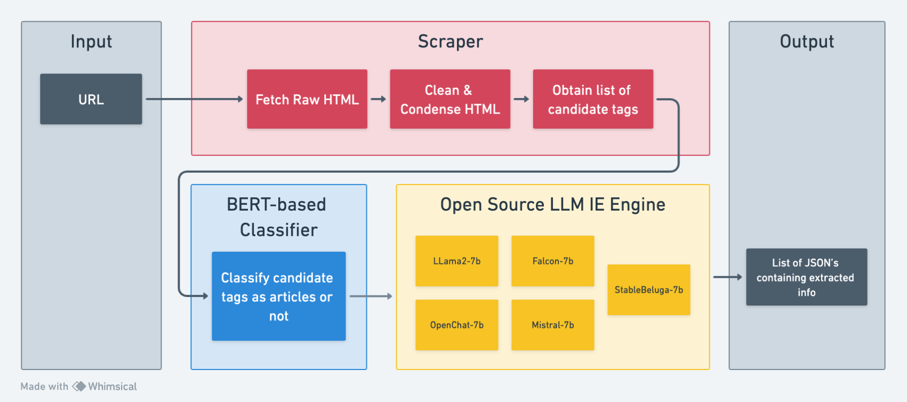

# News Extract

## Overview

The overall goal of this module is to leverage the power of open-source LLMs to automate extracting news headlines and other information relating to specific articles from the homepage of an arbitrary news website. This module functions in 3 steps:

1. Scrape, clean, and segment manageable sized HTML snippets that may or may not contain information of at most 1 article.

2. Classify the scraped HTML snippets as either 'containing information about an article' or 'not containing information about an article'

3. Extract the news headline, news summary, article url, publication date/time, estimated read time, and author from the HTML snippets that do contain information about an article

## Setup

Module Dependencies:

**Python Version: 3.9.18**

**Pip version: 23.3**

Remaining packages Can be installed by running the following command:

``` bash
pip install -r requirements.txt 
```

### Project Structure:

```
manan-jain-news-extract/
    - extraction.ipynb
    - classify.ipynb
    - fine_tune_classifier.ipynb
    - requirements.txt
    - dataset_generation/ 
        -- data/
            --- bbc.txt
            --- cnn.txt
            --- fox.txt
            --- ndtv.txt
            --- nyt.txt
            --- wsj.txt
        -- bbc.ipynb
        -- cnn.ipynb
        -- fox.ipynb
        -- ndtv.ipynb
        -- nyt.ipynb
        -- wsj.ipynb
    - models/
        -- classifier_model/
    - modules/
        -- classifier.py
        -- llm.py
        -- scraper.py
    - extracts/
        -- WashingtonPost.txt
        -- Yahoo.txt
        -- WSJ.txt
```


Important Files:
* `extraction.ipynb`: Main Jupyter Notebook to run the full end-to-end extraction pipeline 
* `modules/classifier.py`: Contains the `Classifier` class which is used to classify tags as articles or not
* `modules/llm.py`: Contains Class wrappers for various open source LLMs that can be used to extract information from positively classified tags. (extraction prompt can be viewed and changed with this class)
* `modules/scraper.py`: Contains helpful functions for scraping tags from news websites

Other Files:
* `classify.ipynb`: Jupyter Notebook used to test the classifier model
* `fine_tune_classifier.ipynb`: Jupyter Notebook used to fine-tune the classifier model
* `models/classifier_model`: Best fine-tuned model for classification
* `/dataset_generation/`: Contains python notebooks and data that was scraped and manually labeled for the Classification portion of this task.
* `/dataset_generation/data`: includes manually labeled data points for classification of tags scraped from various news sites (ex. `bbc.txt` includes html snippets from https://www.bbc.com/news, labeled as either an article or not)
* `/extracts/`: Contains example extraction outputs from various news websites

## Functional Design (Usage)
The easiest way to use this module is by using the `extraction.ipynb` pipeline.

### Scraper:
_Contains functions usefull for scraping an arbitrary news webpage_

A basic usage to obtain properly formatted tags can be implemented as follows:
```python
import scraper
from bs4 import BeautifulSoup

html = scraper.fetch_html("https://www.wsj.com/")
soup = BeautifulSoup(html, 'html.parser')
soup = scraper.clean_html(soup)
soup = scraper.squash_nested_divs(soup)
candidate_tags = scraper.extract_tags(soup)
```

#### Methods:

`fetch_html(url: str, waitUntil: str='networkidle0', setUserAgent: bool=False) -> str`

_Fetches the raw text html of a webpage given a url. Works with dynamic pages_

* Args:
    * url (str): URL of website to fetch html from
    waitUntil (str, optional): What condition to wait for to assume a full page load. Defaults to 'networkidle0'. (means 0 network activity for 500 ms)
* Returns:
    * str: html of a webpage in plain text


`clean_html(soup: BeautifulSoup) -> BeautifulSoup`

_Clean up html by removing unneccesary tags including: ['script', 'style', 'meta', 'link', 'svg']_

* Args:
    * soup (BeautifulSoup): soup object of the html page to clean up

* Returns: 
    * BeautifulSoup: soup object representing condensed html without ['script', 'style', 'meta', 'link', 'svg'] tags


`squash_nested_divs(soup: BeautifulSoup) -> BeautifulSoup`

_Squash consecutively nested divs into a single div and merge attributes._

* Args:
    * soup (BeautifulSoup): soup object for which consecutive div tags must be squashed

* Returns:
    * BeautifulSoup: soup object with squashed and merged divs

`extract_tags(soup: BeautifulSoup) -> list[str]`

_Extract HTML contents from each `<a>`, `<article>`, and `<section>` tag including the `<a>`, `<article>`, or `<section>` tag itself._

* Args:
    * soup (BeautifulSoup): soup object from which tags must be extracted

* Returns:
    * List[str]: List of all the extracted tags as plaintext html

### Classifier:
_The Classifier class is a wrapper class to load and use the Tag Classification Model. Initialize the class using the list of candidate tags obtained from scraping and use as follows:_

```python
from classifier import Classifier

c = Classifier(candidate_tags) # Initialize Classifier with potential article html snippets
c.classify() # Run the Classifier
article_tags = c.get_articles() # Obtain positively classified tags
```

### LLM:
_The LLM module contains wrapper classes to use various different LLMs as extraction engines. All wrapper classes inherit from an abstract class LLM and implment their own variation of `generate_prompt()` to adhere to the specific LLM's instruction prompt template._

A basic usage can be implemented as follows:
```python
from llm import Llama2

html_snippets = [...] # some list of html snippets as strings that have been positively classifed by the classifer (keep length between 5-10 to avoid running out of VRAM)

llm = Llama2() 
extraction = llm.extract(html_snippets)

print(extraction)
"""
Prints: 
[
    {
        'news headline': ...,
        'url to article': ...,
        'news summary': ..., 
        'date/time of publication': ..., 
        'estimated read time': ..., 
        'author': ...
    }, 
    ...
]
"""
```

#### Methods:
`update_system(self, system: str)`

_Update the System Prompt of extraction prompt template_

* Args:
    * system (str): New system prompt to be used


`update_task(self, task: str)`

_Update the task description of the extraction prompt template_

* Args:
    * task (str): New task description of the extraction prompt


`generate_prompt(self, html: str) -> str`

_Generate a prompt in accordance with the specific LLM's prompt template using the System Prompt, Task Description, and HTML snipper from which information must be extracted_ 

* Args:
    * html (str): HTML snippet from which information should be extracted

`extract(self, html: "list[str]", max_new_tokens=256)`

_Extracts news headlines, article url, news summary, publication date/time, estimated read time, author from each html snippet with the list html_

* Args:
    * html (List[str]): list of html snippets from which extraction must be performed
    
    * max_new_tokens (int): Maximum new tokens to be generated from LLM (max size of JSON as string). Defaults to 256.

* Returns:
    * List[dict or str]: Returns a list of dictionaries with extracted information, or a string error message if extraction failed or JSON not present


## Demo video

Include a link to your demo video, which you upload to our shared Google Drive folder (see the instructions for code submission).


## Algorithmic Design 
First scrape, clean, condense and collect a list of candidate html snippets that may or may not contain information about a specific news article using the functions defined in the `Scraper` module.

Next initialize a `Classifier` object using the set of candidate tags obtained in the scraping step. Use the `Classifier` to classify and obtain a list of positively classified tags

Finally, extract information regarding news articles using one of the defined LLM's within the `LLM` as an extraction engine. Extraction happens slowly but can be processed in batched inputs to speed up the extraction throughput. Try processing between 5-10 of the positively classified tags at once.




## Issues and Future Work

* Current method of scraping and collecting candidate html tags may not work for all news websites. Current method makes the assumption that all information about a single article is contained within either a `<a>`, `<article>`, or `<section>` tag. Look into more general scraping methods. 

* Current method of scraping and collecting candidate html tags may occasionally yield duplicate entries. 

* Classifier may need to be retrained if scraping method changes

* Extraction occasionally struggles with extracting extra information such as news summary, estimated read time, publication date/time, and authors. Better extraction results may be achieved upon fine-tuning out-of-the-box models.


## Change log

Fall 2023 (Manan Jain)
* 1/14/2024: Initial working commit made


## References 
LLM papers:

* BERT Paper: https://arxiv.org/abs/1810.04805
* LLama2 Paper: https://arxiv.org/abs/2307.09288
* Falcon Paper: https://arxiv.org/abs/2311.16867
* Mistral Paper: https://arxiv.org/abs/2310.06825
* OpenChat Paper: https://arxiv.org/abs/2309.11235

Papers that influenced primary Development:

* Zero-Shot Information Extraction via Chatting with ChatGPT: https://arxiv.org/pdf/2302.10205.pdf
* Extracting Accurate Materials Data from Research Papers with Conversational Language Models and Prompt Engineering: https://arxiv.org/pdf/2303.05352.pdf
* INSTRUCTION TUNING WITH GPT-4: https://arxiv.org/pdf/2304.03277
* Language Models are Few-Shot Butlers: https://arxiv.org/pdf/2104.07972.pdf
* Promises and Pitfalls of Using LLMs for Scraping Web UIs: http://www-personal.umich.edu/~rkros/papers/LLMs_webscraping_CHI2023_workshop.pdf
* In-Pars Paper: https://arxiv.org/pdf/2202.05144
Other papers for secondary explorations:
* The Internal State of an LLM Knows When its Lying: https://arxiv.org/pdf/2304.13734
* REACT: SYNERGIZING REASONING AND ACTING IN LANGUAGE MODELS: https://arxiv.org/pdf/2210.03629
* Contextualized Query Embeddings for Conversational Search: https://arxiv.org/pdf/2104.08707.pdf
* Active Retrieval Augmented Generation: https://arxiv.org/pdf/2305.06983.pdf
* DocEE Paper: https://tongmeihan1995.github.io/meihan.github.io/research/NAACL2022.pdf